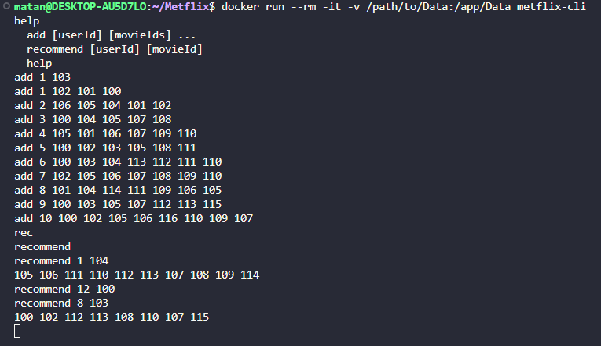
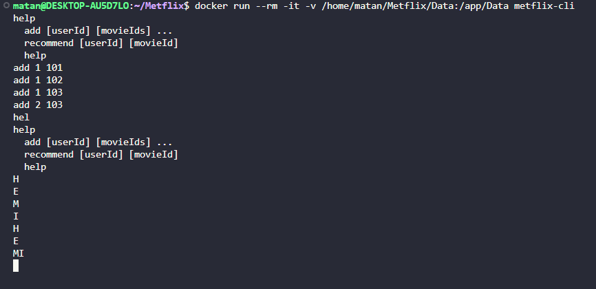

# 🎬 Metflix CLI Application

**Metflix CLI** is a command-line interface application for managing and recommending movies. This tool enables you to add users, track their watched movies, and recommend movies based on shared preferences and user similarity.

---

## ✨ Features

### 1️⃣ Add Users and Movies
- Add a new user and associate movies they have watched.
- Update an existing user's watched movie list.

### 2️⃣ Movie Recommendations
- Recommend movies for users based on shared preferences and similarity.

### 3️⃣ Help Command
- Display available commands and their usage.

---

## 🚀 Getting Started

### 🔧 Prerequisites
Before building or running the application, ensure you have the following installed:
1. **C++17 or later**
2. **CMake 3.10 or later**
3. **Docker** (optional, for containerized builds and tests)

---

### ⚙️ Building the Project

#### 🐳 Using Docker
1. **Set Permissions**  
   Ensure the `Data` folder has the necessary permissions:  
   ```bash
   chmod -R 777 /path/to/Data
   ```

2. **🛠 Build the Docker Image**    
   To build the Docker image, run the following command:
    ```bash
    docker build -t metflix-cli .
    ```

3. **🚀 Run the Docker Container**  
   To run the application in a Docker container, use this command:
   ```bash
   docker run --rm -it -v /path/to/Data:/app/Data metflix-cli
   ```

**Note**: Replace `/path/to/Data` with the absolute path to the `Data` folder on your local machine.  
You can use the command `$(pwd)/Data` in your terminal to get the current directory's `Data` folder path.

### 📖 Usage

Once the application is running, use the following commands:

---

### **Commands**

#### 🆘 **help**
Display available commands and their usage.

**Example**:    
```bash 
help
```
### ➕ **add [userId] [movieIds]...**
Add a new user or update an existing user’s movie list.

**Example**:    
```bash
add 1 101 102 103
```
### 🎥 **recommend [userId] [movieId]**
Recommend movies for a user based on the given movie and user similarity.

**Example**:
```bash
recommend 1 101 
```

---

### 🧪 Running Tests

To ensure the application works correctly, you can run the provided tests. Follow these steps:

#### 🐳 Using Docker
1. **Enter the src folder**   
   To enter the folder that contains the tests, use the following command: 
   ```bash
   cd src
   ``` 

2. **Build the Docker Image with Tests**  
   If you haven't already built the Docker image, do so with the following command:
   ```bash
   docker build -f Dockerfile.tests -t metflix-tests .
   ```

3. **Run the Tests in Docker**  
   Execute the tests inside the Docker container:
   ```bash
   docker run --rm  metflix-tests
   ```

4. **You should get the following output**:   
   ```bash
   Running main() from /usr/src/mytest/build/_deps/googletest-src/googletest/src/gtest_main.cc
   [==========] Running 5 tests from 4 test suites.
   [----------] Global test environment set-up.
   [----------] 1 test from HelpFunctionTest
   [ RUN      ] HelpFunctionTest.DisplayHelpMessage
   [       OK ] HelpFunctionTest.DisplayHelpMessage (0 ms)
   [----------] 1 test from HelpFunctionTest (0 ms total)

   [----------] 2 tests from AddFunctionTest
   [ RUN      ] AddFunctionTest.AddNewUser
   [       OK ] AddFunctionTest.AddNewUser (3 ms)
   [ RUN      ] AddFunctionTest.AddMultipleUsers
   [       OK ] AddFunctionTest.AddMultipleUsers (0 ms)
   [----------] 2 tests from AddFunctionTest (3 ms total)

   [----------] 1 test from StorageTest
   [ RUN      ] StorageTest.RetrieveNonExistentUser
   [       OK ] StorageTest.RetrieveNonExistentUser (0 ms)
   [----------] 1 test from StorageTest (0 ms total)

   [----------] 1 test from UpdateFunctionTest
   [ RUN      ] UpdateFunctionTest.UpdateUserMovies
   [       OK ] UpdateFunctionTest.UpdateUserMovies (0 ms)
   [----------] 1 test from UpdateFunctionTest (0 ms total)

   [----------] Global test environment tear-down
   [==========] 5 tests from 4 test suites ran. (3 ms total)
   [  PASSED  ] 5 tests.
   ```
### 📋 Running Examples

To see the application in action, you can run some example commands. Here are a few to get you started:





---

